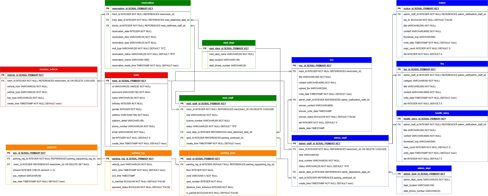

# **[ 서울에스병원 종합 시스템 ]**

---

## *KDT 선도기업형 훈련과정*
## *[에스트래픽] 스마트 모빌리티 DX Academy*

---

## 목차
### 1. 폴더 설명
### 2. 팀원 역할
### 3. 프로젝트 개요
### 4. 프로젝트 주요 기능
### 5. 개발 스택
### 6. ERD
### 7. 사용자 권한별 핵심 기능
### 8. OCR 프로세스
### 9. 실행 방법
### 10. 서비스 확장 계획

---

### 1. 폴더 설명
- 프론트엔드: 260126-project
- 백엔드: middleProject
- 자료: etc

---

### 2. 팀원 역할
- 임동현 (팀장)
1. DB 및 ERD 설계
2. 시스템 통합 백 엔드 구축
3. OCR 연동 번호판 판독 로직 개발
4. 발표 대본 작성 및 발표

- 임소리
1. 사용자 접점 서비스(Web/Kiosk)
2. 통합 프론트 엔드 개발 및 UI 설계
3. 발표 자료 작성

- 오종석
1. 주차장 시스템 백 엔드 구축
2. 진료 연동 정산 로직 구축

- 하재영
1. 실시간 주차 현황판 UI 설계
2. 차량 위치·이용 요금 정보 UI 설계

---

### 3. 프로젝트 개요
1. 서비스  
OCR 기반 입·출차 시스템 운영 및 예약·민원 통합 관리를 지원하는 스마트 병원 솔루션
3. 기획 배경  
웹 통합 병원 시스템 고도화 및 차량 번호판 인식 프로세스 선행 연구를 통한 병원 솔루션 구현
3. 기획 목적  
환자 중심 서비스 접근성·편의성 강화 및 고도화된 보안 기반 행정 최적화

➔ 번호판 인식 기반 주차 최적화 및 체계적인 보안 권한이 조화된 통합 스마트 병원 시스템

---

### 4. 프로젝트 주요 기능
1. OCR 엔진 기반 차량 번호 자동 판독  
2. 동선 최적화형 주차 구역 자동 매핑  
3. 진료 데이터 연동 기반 통합 예약 시스템  
4. 권한별 접근 제어 기반 VOC 통합 관리

---

### 5. 개발 스택
| Frontend             | Backend                    | Database    | OCR                        | OCR Test                   | ERD       |
|----------------------|----------------------------|-------------|----------------------------|----------------------------|-----------|
| *Visual Studio Code* | *Spring Tools for Eclipse* | *pgAdmin 4* | *Spring Tools for Eclipse* | *Spring Tools for Eclipse* | *draw.io* |
| Vue.js               | Java                       | PostgreSQL  | Tesseract OCR              | JUnit 5                    |           |
| JavaScript           | Spring Boot                | HikariCP    | Tess4J                     | Mockito                    |           |
| HTML5                | Spring                     | MyBatis     | Java 2D API                |                            |           |
| CSS3                 | Maven                      | RegEx       |                            |                            |           |
| Vite                 | Tomcat                     |             |                            |                            |           |
| Axios                |                            |             |                            |                            |           |
| Node.js              |                            |             |                            |                            |           |

---

### 6. ERD
**ERD - 전체**  
  

**ERD - 회원 및 차량**  
  

**ERD - 회원 및 의료진**  
  

**ERD - 회원 및 행정직**  

---

### 7. 사용자 권한별 핵심 기능
|                 | 일반회원 | 의료진 | 행정-원무 | 행정-홍보 |
|-----------------|---|---|---|---|
| *차량 CRUD*       | O | O | O | O |
| *진료예약 CRUD*     | O | O | O | O |
| *진료예약 강제삭제*     | X | O | X | X |
| *VOC 작성*        | O | X | X | X |
| *VOC 답변/강제삭제*   | X | X | O | X |
| *공지사항/FAQ CRUD* | X | X | O | X |
| *건강이야기 CRUD*    | X | X | X | O |

---

### 8. OCR 프로세스
| 전처리 기법 (Preprocessing) | 완벽+부분 | 완벽 | 부분 |
| :--- | :---: | :---: | :---: |
| 확대x2, 바이큐빅 보간, 흑백화, 패딩 | 86.9% | 68.9% | 18.0% |
| 확대x3, 바이큐빅 보간, 명암 조절, 이진화, 패딩 | 83.8% | 59.3% | 24.5% |
| 확대x2, 바이큐빅 보간, 가우시안 블러, 패딩 | 87.5% | 66.4% | 21.1% |
| **확대x2, 딜레이션, 가우시안 블러, 패딩** | **90.3%** | **69.8%** | **20.5%** |
| 확대x2, 딜레이션, 에로전, 패딩 | 87.1% | 66.1% | 21.0% |
| 확대x3, 딜레이션, 패딩 | 88.9% | 65.9% | 23.0% |
| 확대x2, 딜레이션, 명암 조절, 패딩 | 89.9% | 69.5% | 20.4% |
| 확대x2, 색상 반전, 패딩 | 78.0% | 67.1% | 10.9% |

---

### 9. 실행 방법
1. **Spring Tools for Eclipse** 실행
2. **middleProject** 선택
3. src/main/java ➔ com/mbc/mid ➔ **MiddleProjectApplication.java** 실행 (초록색 시작 버튼 Run middleProject)
4. **Visual Studio Code** 실행
5. 터미널 ➔ 새 터미널 ➔ powershell ➔ **Command Prompt (cmd)**
6. **cd 260126-project** (cd 26*) ➔ **npm run dev**

**LOMBOK 적용 방법**
1. C:\Users\사용자이름\.m2\repository\org\projectlombok\lombok\버전\ **lombok-xxx.jar 실행**
2. 왼쪽 하단의 **[Specify location...]** 버튼 클릭
3. **SpringToolsForEclipse.exe** (SpringToolSuite4.exe) 선택
4. 우측 하단의 **[Install / Update]** 버튼 클릭
5. **SpringToolsForEclipse** 다시 실행
6. **Project ➔ Clean**

1. C:\Users\사용자이름\.m2\repository\org\projectlombok\lombok\버전\ **lombok-xxx.jar 복사**
2. C:\sts-5.0.1.RELEASE\ 로 이동 후, **lombok.jar 붙여넣기** (SpringToolsForEclipse.exe와 lombok.jar 나란히)
3. **SpringToolsForEclipse.ini** 메모장으로 실행
4. 맨 아랫줄에 **-javaagent:lombok.jar** (-javaagent:C:\sts-5.0.1.RELEASE\lombok.jar) 붙여넣기
5. **SpringToolsForEclipse** 다시 실행

---

### 10. 서비스 확장 계획
- AI 기반 차량 인식 고도화
1. Python YOLO 기반의 딥러닝 객체 탐지 모델 도입
2. 기상 악화 및 야간 환경에서의 OCR 인식 정밀도 개선
3. 차량 객체 추적(Object Tracking)을 통한 주차 유도 자동화
4. 
- E-Mobility 연동형 스마트 파킹
1. 전기차(EV) 충전 구역 자동 배정 및 점유 현황 관제
2. 충전 시간과 주차 요금을 결합한 통합 정산 시스템 확장
3. IoT 센서 연동을 통한 실시간 주차 시각화 대시보드 구축
